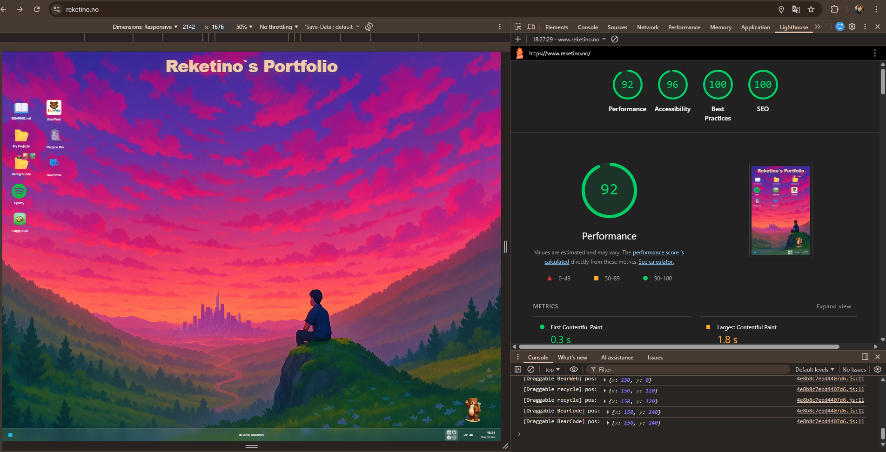

# Bear Even – Developer Portfolio  
Building things with Next.js 16, Tailwind 4, custom APIs and a UI that feels more like a tiny desktop OS than a traditional portfolio.  
Cycling, trail running, gaming and coding are the things that keep me moving — and this project is where I learn and experiment the most.

---

## 🚀 About this Portfolio

This portfolio is not a classic “scroll and read” website.  
It's designed as a lightweight OS environment running in your browser.

I use it to explore UI/UX ideas, animations, component structure and API integrations.

**The portfolio includes:**

- 🪟 Draggable window-based UI  
- 🔧 Custom taskbar with app icons  
- 🌌 Tech/cyber animated background  
- 📬 Contact page with form + social links  
- 💾 Local storage saving window positions  
- ⚙️ Custom API Routes  
  - Background API  
  - Steam API  
- 📱 Full mobile-friendly layout  
- 💻 Built entirely with **JavaScript + JSX** (no TypeScript)

---

## 🛠️ Tech Stack

- **Next.js 16**
- **React 19**
- **Tailwind CSS v4**
- **JavaScript**
- **JSX**
- **Framer Motion**
- **Vercel**
- **Custom API Routes (Background API & Steam API)**

---

## 📂 Features

- 🪟 **Draggable Windows** – move small “apps” freely around the screen  
- 🎛️ **Custom Taskbar** – Windows-style UI redesigned for my layout  
- 🌫️ **Cyber Background Animation** – powered by custom Background API  
- 🎮 **Steam API Integration** – fetches live game/profile data  
- 💬 **Contact Page** – email, socials and built-in form  
- 💾 **Persistent UI State** – windows stay where you left them  
- 📱 **Responsive** – works smoothly on desktop and mobile
---

## 📊 Performance & Accessibility

This portfolio has been tested using Google Lighthouse (Desktop):

- Performance: 92
- Accessibility: 96
- Best Practices: 100
- SEO: 100



---

## 🧠 Why I Built This

I wanted a portfolio that stands out and feels more like a creative playground than a brochure.

This project lets me explore:

- Animation & motion design  
- Component architecture  
- API integrations  
- Interaction-heavy interfaces  
- Creative layouts  
- Real-time data  

It represents me better than a simple static page ever could.

---

## 🟢 Currently Working On:

- BearWeb layout to have more Chromestyle & feel.

---

## 🪄 Future Ideas

- Windows XP Mode Toggle

---

## 🧩 Run Locally

```bash
npm install
npm run dev
